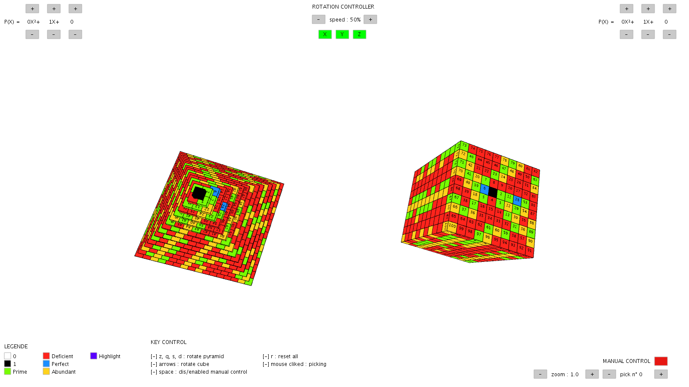

# 3D Ulam Spiral [En]
3D Ulam Spiral is a project, realized in [Processing](https://processing.org), which aims at representing in 3D the distribution of prime, deficit, perfect and abundant numbers.

Two geometric models, a pyramid and a cube, are composed of subcubes associated with a number *n*. The values of the subcubes are the images by the second degree polynomial associated to the models.

This programme was developed as part an academic project, in collaboration with  collaboration with [Pradana Aumars](https://github.com/aumars), at the University of Paris-Saclay.

## Functionalities
To facilitate the visualisation of the models, it is possible to :
- Control the speed and axis of rotation
- Manually control the rotation
- Change the coefficients of the second degree polynomials
- Click on a sub-cube to highlight it in both models

## Usage
To use this program, make sure you have correctly installed [Processing v3](https://processing.org/download).

Then, run the file [main.pde](/main/main.pde).

# 3D Ulam Spiral [Fr]
3D Ulam Spiral est un projet, réalisé en [Processing](https://processing.org), qui vise à représenter en 3D la répartition des nombres premiers, déficits, parfaits et abondants.

Deux modèles géométriques, une pyramide et un cube, sont composés de sous-cubes associés à un nombre *n*. Les valeurs des sous-cubes sont les images par le polynôme du second degré associer aux modèles.

Ce programme a été réalisé au cours d'un projet académique, en 
collaboration avec [Pradana Aumars](https://github.com/aumars), à l'université Paris-Saclay.

## Fonctionnalités
Pour facilité la visualisation des modèles, il est possible de :
- Contrôler la vitesse et l'axe de rotation
- Contrôler manuellement la rotation
- Modifier les coefficients des polynômes du second degré
- Cliquer sur un sous-cube pour le faire apparaître en surbrillance dans les deux modèles

## Usage
Pour utiliser ce programme, assurez-vous d'avoir correctement installé [Processing v3](https://processing.org/download).

Ensuite, exécutez le fichier [main.pde](/main/main.pde).

